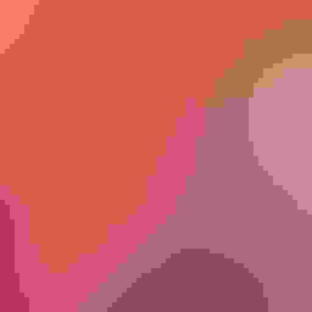

# img_deg

img_deg is a command-line tool that allows you, as the name suggests, degrade images. This allows for unexpected ways of seeing the image, and may lead to inspiration in any number of art projects.

## Dependencies

This program requires [libvips](../../libvips/libvips) to function properly. Before installing this, please make sure you have vips installed on your machine. 

## Usage
If successfully built, you will now have an executable img_deg in your directory.

While still in the directory, use the program as follows:

```
./img_deg filename.jpg savename.jpg quality blur_amount zoom_amount
```

The **quality** argument is between 1 - 75. The quality argument is essentially how badly you want the processor to output the image. 

The **blur_amount** argument is between 0 - 100. This blurs it.

The **zoom amount** takes an integer between 1 and 10, and this determines the amount it will zoom. By default, the zoom will always focus on the top-left, as the default coordinates are [0,0]. This can be changed in degrader.cpp by changing two arguments in the function:

```
VImage Degrader::resize(VImage original, VImage degraded){
    double w = original.width();
    double h = original.height();

    VImage cropped = degraded.crop(0,0, w, h); //the first two values here can be fine tuned based on your needs

    return cropped;
}
```

 Play around with it! After changing the values, re-make the executable and go to town. 

Additionally, the program will output some helpful info on the specifications of the images. It will also, for some reason, declare a segmentation fault. I am not sure what this is about - if you have any insight please drop me a line or submit a pull request! 

## Installation

To use install simply make the repo

```
make -B
```

## Example

```
./img_deg lena.jpg lena2.jpg 1 55 2 
```



